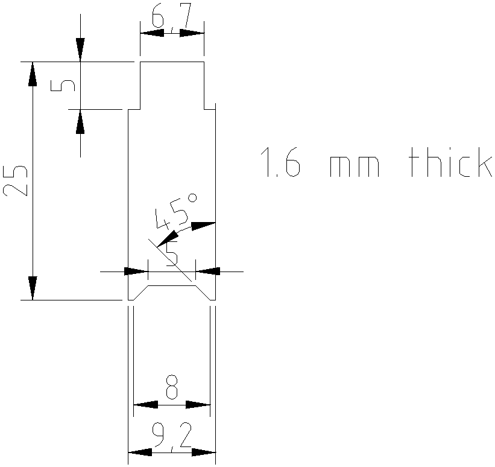

# lower-tool

A tool for removing the lower clip from a Vaisala RS41-SGP radiosonde.

## Instructions for use

1.  Press the pronged end of the tool into the lower clip.  A click should be
    heard as the clip releases.

2.  Use the other end of the tool to press the clip out enough to easily grasp
    and remove from the back of the sonde.

## Instructions for printing

I printed on a Prusa with PLA filament using a 0.2 mm layer height, default 2
layer outer shell, and solid fill.  The tool isn't too fussy, so a variety of
printing options will likely work fine.

## Design notes

Measurements were made from a sample RS41-SGP radiosonde.

A outline was drawn with LibreCAD and saved as a .dxf file.

A two line OpenSCAD file was used to import the .dxf outline and extrude it to
the correct thickness.  Then the design was exported as a .stl model for
printing.

Drew Arnett, n7da
